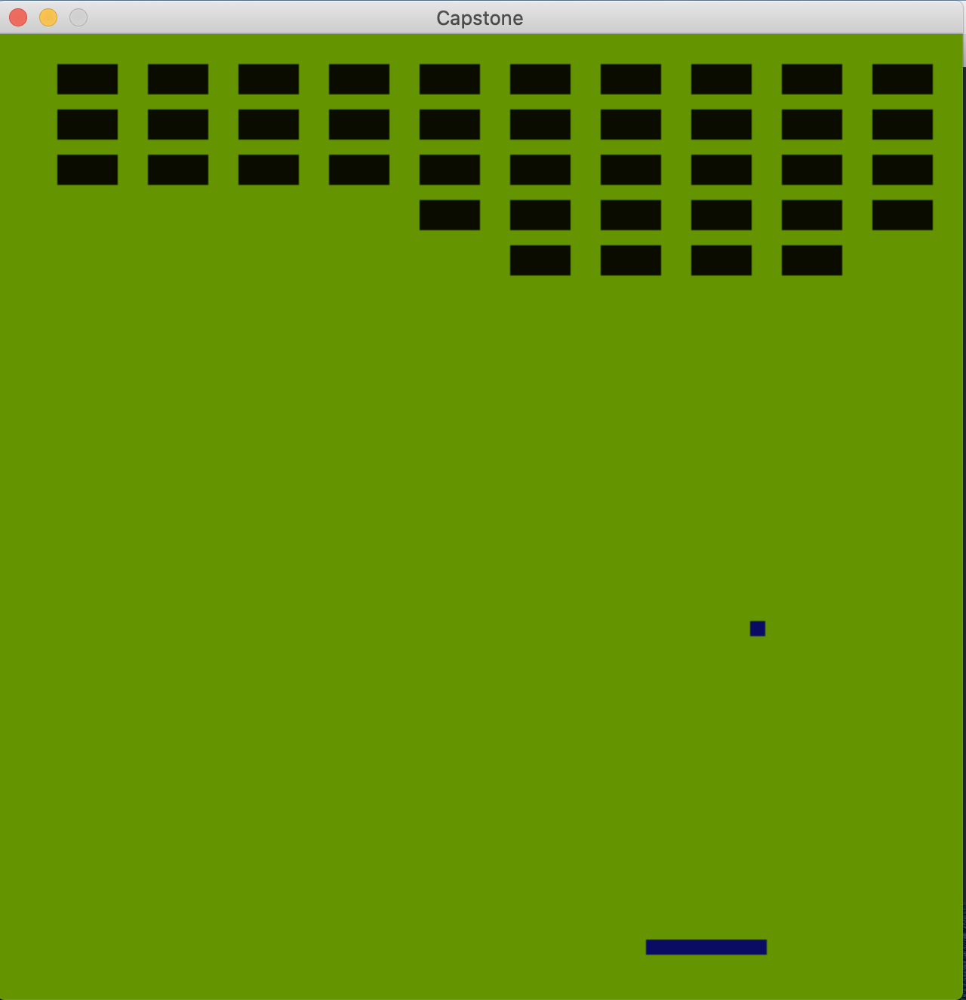

# Udacity C++ Nanodegree Program - Capstone
This is a simple demonstration of a basic game utilizing the SDL Framework.
The goal is to demonstrate how one can make a simple game engine.
The game itself is an overly simple implementation of a tile tennis. 
The game is probably not possible to win at this stage as the balls path is completely deterministic and does not visit all the regions of the screen in reasonable time.


## Dependencies
## Dependencies for Running Locally
### cmake >= 3.7
  * All OSes: [click here for installation instructions](https://cmake.org/install/)
### make >= 4.1 (Linux, Mac), 3.81 (Windows)
  * Linux: make is installed by default on most Linux distros
  * Mac: [install Xcode command line tools to get make](https://developer.apple.com/xcode/features/)
  * Windows: [Click here for installation instructions](http://gnuwin32.sourceforge.net/packages/make.htm)
### SDL2 >= 2.0 (RECOMMENDED)
  * SDL2 installation can be challenging, but works out-of-the box with `vcpkg`, hence this is the recommended way of installing SDL for painless cross-platform use. Follow the installation instructions to install it on your system: [vcpkg on Github](https://github.com/microsoft/vcpkg). Then install SDL2 like this:
  ```bash
  vcpkg install sdl2
  ```
### Alternative installation of SDL2 >=2.0 (NOT RECOMMENDED)
  * **You may need to modify the `CMakeLists.txt`** file to make this work.
  * All installation instructions can be found [here](https://wiki.libsdl.org/Installation)
  * Note that for Linux, an `apt` or `apt-get` installation is preferred to building from source.
### gcc/g++ >= 5.4
  * Linux: gcc / g++ is installed by default on most Linux distros
  * Mac: same deal as make - [install Xcode command line tools](https://developer.apple.com/xcode/features/)
  * Windows: recommend using [MinGW](http://www.mingw.org/)

## Build
1. Clone or download this repo.
2. Make a folder int the project root and build it from there
```bash
$ mkdir build && cd build
$ cmake .. && make
$ ./Capostone
```
## Features overview
This is a demonstration of how you can make a simple game engine using only SDL.  The engine itself is rather
simple nevertheless it implements the following features:

- A timed game loop that ensures the calling of the `GameObject`'s `Update()` and `Draw()` methods.
- An easy way to register a  `gameObject`, which is being updated and drawn then by the _enginge_
- A simple collision detection mechanism
- Input reader to process the user's input.

Please study the comments provided in the header files in the `include folder` for further reference.

## Acknowledgements

The codebase is inspired by [Udacity's CppND Snake Game](https://github.com/udacity/CppND-Capstone-Snake-Game), especially the render function and the game loop.  

## Useful links
- [SDL](https://www.libsdl.org)
- [Lazy Foo's Productions](https://lazyfoo.net/tutorials/SDL/index.php)

## Self assesment for Project Review

**NOTE: ** The header files and `cpp` files are stored separately in the `./include` and `./src` folder
respectively.

Addressed rubric points  


| Requirement                     | Self Assesment                     | Reference    |
| ------------------------------- | --------------------------------- |:------------ |
| A variety of control structures are used in the project. | OK (1)        | `Game.cpp:7` |
| The project reads data from an external file  |: N/A                 | N/A          |
| The project accepts input from a user | OK, Racket control (2)          | `Controller.cpp:20` |
| The project code is organized into classes | OK (3)                     | `GameObject.h:13`    |
| All class data members are explicitly specified  | OK (4)               | `GameObject.h:13`  |
| Member initialization lists used where possible   | OK (5)          | `Ball.h:5`     |
| All class member functions document their effects  | OK (6)         | `Vector2d.h:4`  |
| Appropriate data and functions are grouped into classes | OK (7)    | `Racket.h:17-20` |
| One function is overloaded                        | OK(8)           | `Vector2d.h:11-12`|
| One function is declared with a template          | OK(9)           | `Vector2d.h:18`   |
| Two functions use pass-by-reference               | OK(10)          | `Vector2d.h:18-67`  |
| one class that uses unmanaged dynamically allocated memory | N/A    | N/A               |
| RAII Pattern used                                 | OK(11)          | `Game.h:41`     |
| Rule of 5                                         | N/A             | N/A           |
| For classes with move constructors...             | N/A             | N/A           |
| The project uses at least one smart pointer       | OK(12)          | `BoundingBox.h:14`  |

The project does not employ concurrency.


